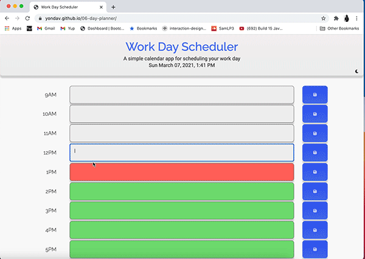
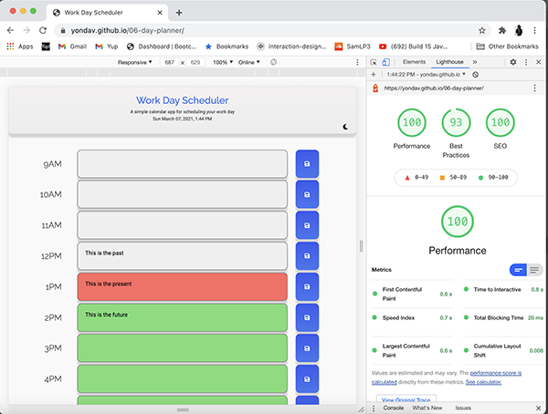

# 06-day-planner

I was assigned to build out a demo of a day planner app that allows users to input tasks at a given our in the day and save it to local storage. The hours are color coded based on the current hour.

- <a href="https://yondav.github.io/06-day-planner/">Deployed Webpage</a>

<!-- screengrabs -->

## My approach

When initially contemplating the architecture of this project, I considered the fact that the functionality of the current application calls for static elements. That is to say that the hours in question are always 9-5 at the moment and so it's sensible to hardcode those elements into the html file and create the functionality dynamically using JavaScript.

Having said that, I also considered that this could be an open ended project. Perhaps we would want to expand on the application now that we see its functionality by giving users an option to view different hours in the day or view their weekly or monthly schedule. With that in mind, I went ahead and recreated the same exact application dynamically and pushed it to branch: alt.

As of now they are exactly the same but the idea here is that if we decide at any point that we want to expand on the application by toggling new features like the ones mentioned above, we won't have to rewrite the program. We can instead begin working on the alternate branch to add more dynamic and robust features.

## Follow these steps to navigate the repository

### Main Branch

The following file path is for the live webpage.

- Ensure you are on the main branch
- Open index.html to access the html file
- Nested in the assets folder, you will find two folders: css and js
- In the css folder you will find style.css
- In the js folder you will find app.js

### Alt Branch

The following file path is for an alternate build with more potential for expansion

- Ensure you are on the alt branch
- Open index.html to access the html file
- Nested in the assets folder, you will find two folders: css and js
- In the css folder you will find style.css
- In the js folder you will find app.js

The assignment was to create functionality in an existing html file. Given the objective to develop this into a functioninal scheduling app, I enjoyed the idea of approaching it in two different ways. It's a very simple application as it is now but I see the logical path to expanding on it. It was fun playing with bootstrap's class list and learning how to use my own styles to collaborate with bootstrap's built in features.

### APIs Used

- <a href="https://jquery.com/">jQuery</a>
- <a href="https://momentjs.com/">Moment.js</a>
- <a href="https://getbootstrap.com/">Bootstrap</a>
- <a href="https://fontawesome.com/">Font Awesome</a>
- <a href="https://fonts.google.com/">Google Fonts</a>
